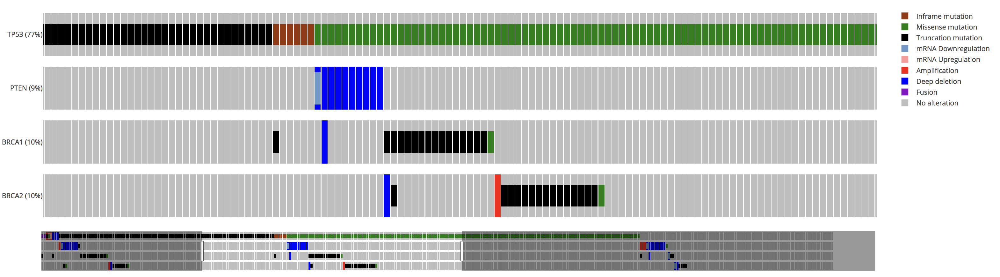
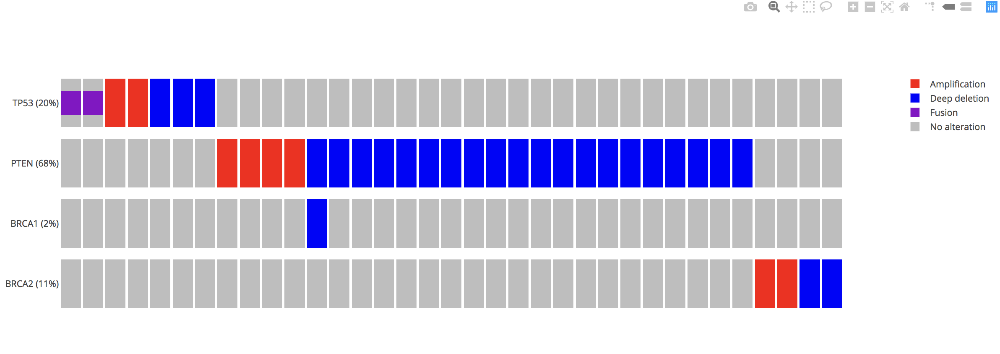

# React OncoPrint

OncoPrint charts in React

> A React component to create OncoPrint charts.

[](https://travis-ci.org/plotly/react-oncoprint)


<!--  -->




## Getting started


### Installation

For [yarn](https://yarnpkg.com/en/) users, run:

```sh
$ yarn add react-oncoprint
```

For [npm](https://www.npmjs.com/) users, run:

```sh
$ npm install react-oncoprint
```


### Usage

```js
import React from 'react';
import OncoPrint from 'react-oncoprint';

class App extends React.Component {
  render() {
    const data = [
      {
        sample: 'TCGA-25-2392-01',
        gene: 'TP53',
        alteration: 'FUSION',
        type: 'FUSION',
      },
      {
        sample: 'TCGA-25-2393-01',
        gene: 'TP53',
        alteration: 'FUSION',
        type: 'FUSION',
      },
      // ...
    ];

    return (
      <OncoPrint data={data}/>
    );
  }
}
```


## Development


### Testing locally

Get the code:

```
$ git clone https://github.com/plotly/react-oncoprint
```

Install the project `dev` dependencies:

```
# Install dependencies
$ yarn

# Watch source for changes and build to `src/lib/`
$ yarn start
```

The React app demo should be available at: http://localhost:8080/.


### Run storybook

Run the development environment in a separate window (it starts
[Storybook](https://github.com/storybooks/storybook) with a live-reload mode):

```
$ yarn storybook
```

The Storybook should be available at: http://localhost:6006/.


### Deploying the Storybook on `gh-pages`

:warning: You must have push access to run this command (or use it in your own
fork).

We use [Storybook Deployer](https://github.com/storybooks/storybook-deployer) to
deploy the build version of the Storybook on GitHub (`gh-pages`):

```
$ yarn deploy-storybook
```


### Build and releases

To build the production version of this library, run the command below, which
will create a `dist/` folder containing the required files:

```
$ yarn build
```

In order to release a new version, you can push a git tag and Travis-CI will
automatically publish a npm release at:
https://www.npmjs.com/package/react-oncoprint. There is no need to run `yarn
build` by yourself See the [`.travis.yml`](.travis.yml) for further information.


## Contributing

Thanks for your interest in maintaining the library!
Please see the [CONTRIBUTING](CONTRIBUTING.md) file.


## Contributor Code of Conduct

Please note that this project is released with a [Contributor Code of
Conduct](http://contributor-covenant.org/). By participating in this project you
agree to abide by its terms. See [CODE_OF_CONDUCT](CODE_OF_CONDUCT.md) file.


## License

react-oncoprint is released under the MIT License. See the bundled
[LICENSE](LICENSE) file for details.
