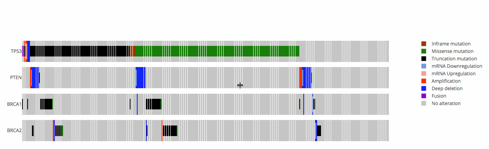

# react-oncoprint

> A React component to create OncoPrint charts.

[](https://travis-ci.org/plotly/react-oncoprint)


## The big picture




## Getting started

### Installation

:warning: this library has not been published on the NPM registry yet, therefore
it cannot be installed _via_ `npm` or `yarn`.

For [yarn](https://yarnpkg.com/en/) users, run:

```
$ yarn add react-oncoprint
```

For [npm](https://www.npmjs.com/) users, run:

```
$ npm i --save react-oncoprint
```

### Usage

```js
import React from 'react';
import OncoPrint from 'react-oncoprint';

class App extends React.Component {
  render() {
    const data = [
      {
        sample: 'TCGA-25-2392-01',
        gene: 'TP53',
        alteration: 'FUSION',
        type: 'FUSION',
      },
      {
        sample: 'TCGA-25-2393-01',
        gene: 'TP53',
        alteration: 'FUSION',
        type: 'FUSION',
      },
      // ...
    ];

    return (
      <OncoPrint data={data} />
    );
  }
}
```


## Development

### Getting started

Get the code:

```
$ git clone https://github.com/plotly/react-oncoprint
```

Install the project `dev` dependencies:

```
$ yarn install
```

Run the development environment in a separate window (it starts
[Storybook](https://github.com/storybooks/storybook) with a live-reload mode):

```
$ yarn dev
```

The Storybook should be available at: http://localhost:6006/.

### Running the test suite

We use [Jest](https://facebook.github.io/jest/):

```
$ yarn test
```

You can "watch" the tests with:

```
$ yarn test --watch
```

You can get the coverage report by running:

```
$ yarn test --coverage
```

### Code formatter, linter and type checker

We use [Prettier](https://prettier.io/) and [ESLint](https://eslint.org/):

```
$ yarn lint
```

The ESLint `--fix` automatically runs Prettier for you, so to check and fix the
code, run:

```
$ yarn lint --fix
```

We use [Flow](https://flow.org/) to statically check the code and identifies
problems:

```
$ yarn flow
```

### Deploying the Storybook on `gh-pages`

:warning: You must have push access to run this command (or use it in your own
fork).

We use [Storybook Deployer](https://github.com/storybooks/storybook-deployer) to
deploy the build version of the Storybook on GitHub (`gh-pages`):

```
$ yarn deploy-storybook
```

### Build and releases

// TODO


## Contributing

Please, see the [CONTRIBUTING](CONTRIBUTING.md) file.


## Contributor Code of Conduct

Please note that this project is released with a [Contributor Code of
Conduct](http://contributor-covenant.org/). By participating in this project you
agree to abide by its terms. See [CODE_OF_CONDUCT](CODE_OF_CONDUCT.md) file.


## License

react-oncoprint is released under the MIT License. See the bundled
[LICENSE](LICENSE) file for details.
